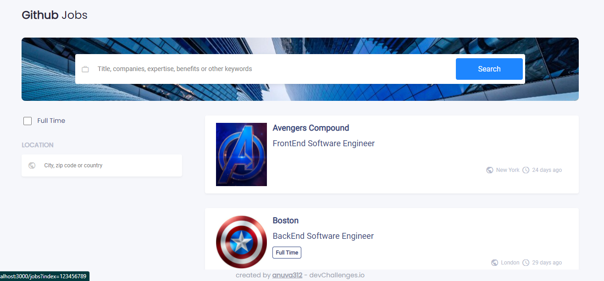
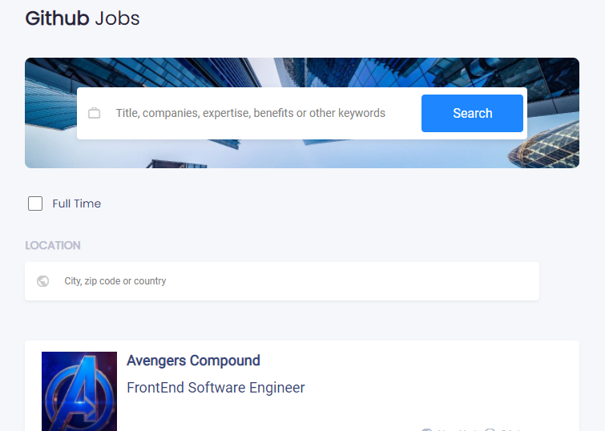
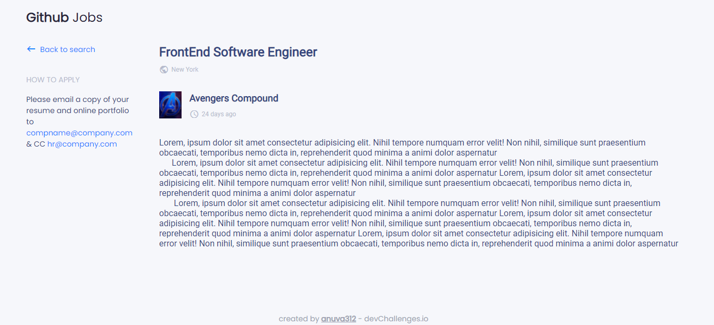
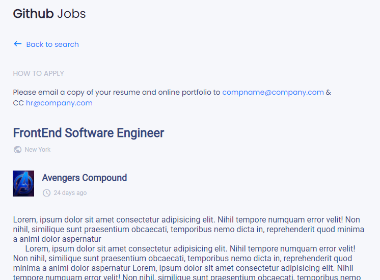

# Country

Solution for the [Github Jobs Challenge](https://devchallenges.io/challenges/TtUjDt19eIHxNQ4n5jps) from [Devchallenges.io](https://devchallenges.io).

<!-- TABLE OF CONTENTS -->

## Table of Contents

- [Challenge](#challenge)
- [Solution](#solution)
  - [Demo](#demo)
  - [Built With](#built-with)
- [How to Use](#how-to-use)
- [Acknowledgements](#acknowledgements)

<!-- Challenge -->

## Challenge

Challenge: Create a job search using an API. Use Front-end libraries like React or Vue.

Fulfill user stories below:

- User story: I can see a list of jobs in a city by default
- User story: I can search for jobs with a given keyword
- User story: I can search for jobs with a city name, zip code, or other location
- User story: I can select one option from at least 4 pre-defined options
- User story: I can search for a full-time job only
- User story: I can see a list of jobs with their logo, company name, location, and posted time.
- User story: When I select a job, I can see job descriptions and how to apply like the given design.
- User story: When I am on the job details page, I can go back to the search page
- User story (optional): I can see a list of jobs in the closest city from my location by default
- User story (optional): I can see jobs on different pages, 5 items on each page

<!-- Solution -->

## Solution

Since the Github Jobs API has been deprecated, I have used local data from the file _data.js_ to mock the API response.

All user stories except the optional ones have been fulfilled.

- For searching using keywords, the job-title, location, and some predefined keywords defined in the jobs object in _data.js_ have been used.
- Searching for jobs based on city, zip-code and country have been fulfilled using _grouped select_ options of [react-select](https://react-select.com/home).
- The routing has been made possible using [react-routers](https://reactrouter.com/).

### Demo

Find the site in action [here]()!

#### Home Page



#### Home Page - Mobile View



#### Jobs Page



#### Jobs Page - Mobile View



### Built With

- [React](https://reactjs.org/)

<!-- How To Use -->

## How To Use

To clone and run this application, you'll need [Git](https://git-scm.com) and [yarn](https://yarnpkg.com/). From your command line:

```bash
# Clone this repository
$ git clone https://github.com/anuva312/GithubJobsChallenge-devChallenges

# Install dependencies
$ yarn install

# Run the app
$ yarn start
```

## Acknowledgements

- [React Router](https://reactrouter.com/)
- [React Select](https://react-select.com/home)
